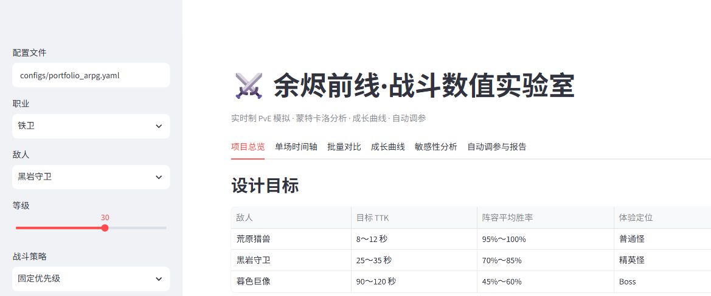

# 余烬前线：实时 PvE 战斗平衡研究

一套面向游戏数值策划作品集的实时战斗模拟、统计分析与自动调参工具。项目用原创 ARPG 案例展示如何把“战斗手感目标”转化为可计算指标，再通过蒙特卡洛实验、成长曲线、敏感性分析和 Pareto 搜索验证设计。

> 核心原则：算法生成候选，策划负责定义目标、解释差异并做最终取舍。



## 项目亮点

- 双边连续事件战斗：技能 CD、施法、后摇、命中、闪避、暴击、Buff、资源与死亡判定均进入时间轴。
- 可靠指标：精确 TTK/TTD、有效伤害与溢出伤害分离、P10/P50/P90、Wilson 胜率区间、Bootstrap TTK 区间。
- 三类操作策略：固定优先级、爆发对齐、保守生存。
- 1～50 级成长验证：铁卫、风痕游侠、星火术士对普通怪、精英怪和 Boss。
- 两层敏感性分析：±5%/±10% 局部弹性，以及拉丁超立方采样后的 Spearman 相关性。
- 多目标自动调参：同时衡量 TTK、胜率、职业输出差异和参数改动成本，输出 Pareto 候选而非单一“标准答案”。
- Streamlit 中文仪表盘、CLI、YAML 配置、Markdown/CSV/JSON/PNG 报告和自动化测试。

## 快速开始

```powershell
python -m venv .venv
.venv\Scripts\Activate.ps1
python -m pip install -e ".[dev]"

# 单场战斗（包含完整事件日志）
python -m combat_balance --config configs/portfolio_arpg.yaml simulate --single --player vanguard --enemy elite --level 30 --policy priority

# 1,000 场蒙特卡洛模拟
python -m combat_balance --config configs/portfolio_arpg.yaml simulate --runs 1000 --player ranger --enemy boss --level 30 --policy burst

# 敏感性分析
python -m combat_balance --config configs/portfolio_arpg.yaml analyze --runs 300 --samples 64

# 多目标调参；先用 --quick 验证完整流程
python -m combat_balance --config configs/portfolio_arpg.yaml optimize --quick

# 生成全职业、全敌人、全等级检查点报告
python -m combat_balance --config configs/portfolio_arpg.yaml report --runs 100

# 启动网页仪表盘
streamlit run app.py
```

运行测试：

```powershell
pytest
```

## 数值模型

等级只通过成长属性生效，避免“属性成长 + 额外等级增伤”重复放大：

```text
属性(L) = 基础属性 × (1 + 每级成长率)^(L - 1)
防御倍率 = K(L) / (K(L) + 防御)
K(L) = K基础值 + L × K每级成长
有效伤害 = min(结算伤害, 目标剩余生命)
```

战斗从双方 `ready` 事件开始。技能 CD 从施法开始计时，伤害在施法结束时结算，后摇结束后角色重新进入可行动状态。同一时间戳的伤害同时结算，因此支持双杀；死亡角色尚未结算的后续事件会取消。

完整设计依据见 [数值设计说明](docs/design.md)，调参叙事见 [案例研究](docs/case-study.md)。

## 配置与输出

主配置为 `configs/portfolio_arpg.yaml`，由 Pydantic 严格校验。`configs/initial_draft.yaml` 继承主配置并覆盖早期失衡参数，用于复现调参前后对比。角色、技能、成长率、策略、体验目标和优化边界均可配置。

CLI 默认把分析文件写入 `artifacts/`：

- `summary.json`：场景指标摘要；
- `trials.csv`：逐场结果；
- `skill_stats.csv`：技能使用、命中、暴击、伤害占比与 CD 利用率；
- `pareto.csv`：非支配候选；
- `report.md` 与 PNG 图：可直接阅读的分析报告。

固定 seed 会为每一场战斗派生独立随机流，因此改变并行 worker 数不会改变结果。

## 已验证结果

在 Lv30、固定 seed、每组 1,000 场的实验中，平衡版普通怪/精英怪/Boss 的阵容平均 TTK 分别为 9.26/26.19/94.59 秒，阵容平均胜率为 100.0%/78.0%/59.4%，职业有效 DPS 差距为 5.4%/6.2%/7.3%。完整多目标搜索使用 768 个候选并以 10,000 场总样本复核，最终确认人工平衡基线已经是满足全部约束且改动成本最小的方案。

当前机器上 10,000 场默认战斗实测约 10.7 秒，低于 30 秒验收线。15 项自动化测试全部通过，核心包测试覆盖率为 90%。

## 作品集材料

- [数值设计说明](docs/design.md)
- [完整案例研究](docs/case-study.md)
- [简历描述与面试讲解](docs/resume-and-interview.md)
- `legacy/`：最初三个原型，用于展示从期望伤害公式到双边事件模拟器的迭代过程；主程序不会导入它们。

## 技术栈

Python 3.11～3.13、Pydantic、NumPy、Pandas、SciPy、Joblib、Matplotlib、Plotly、Streamlit、Pytest。

项目不依赖现成游戏 IP，只研究单角色对单敌人的实时 PvE；不包含组队、经济系统、随机词条或联网服务。
